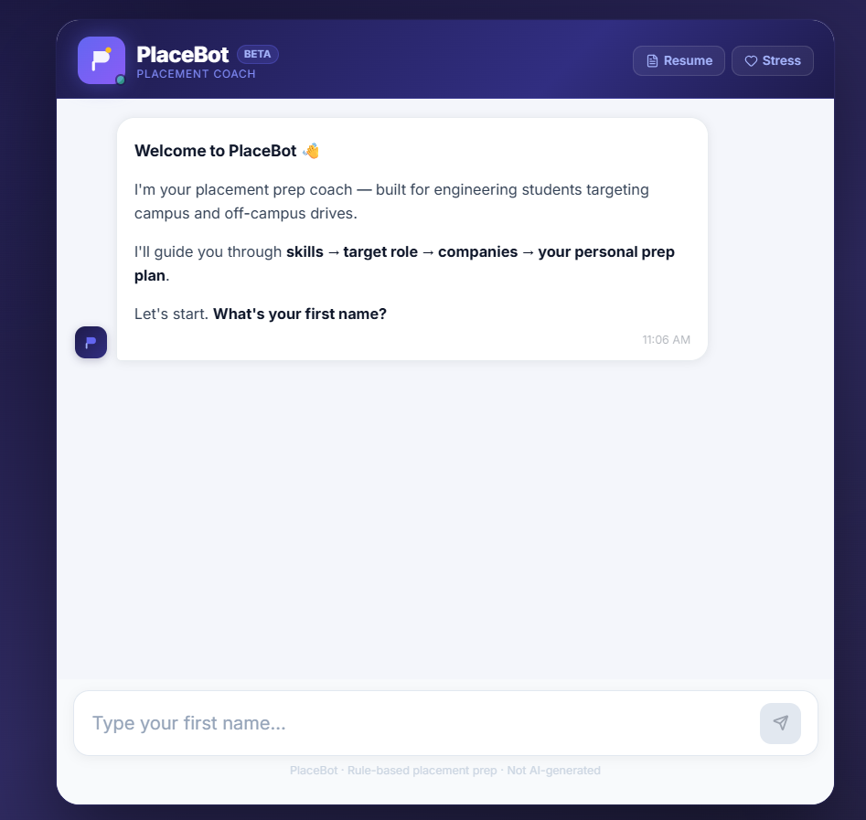
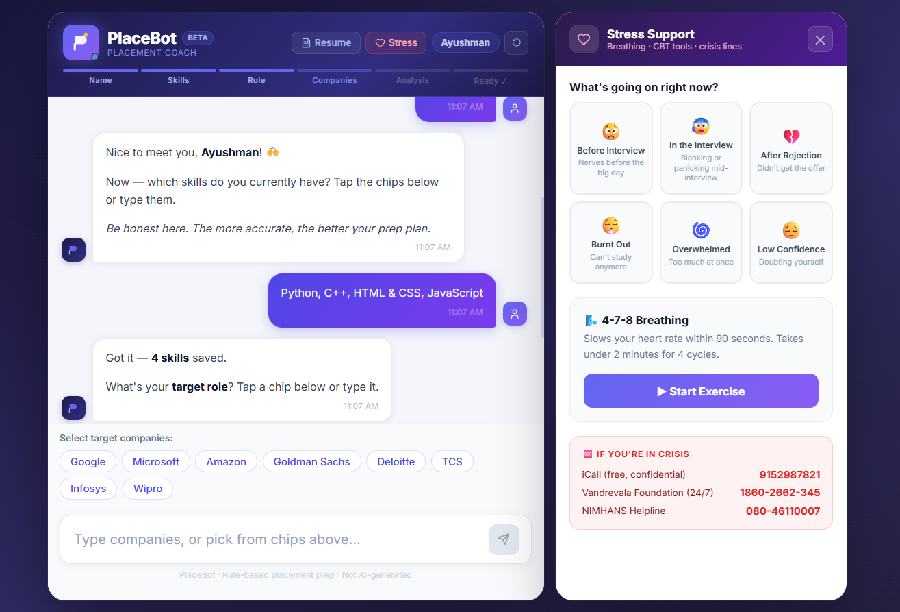

# PlaceBot

A placement preparation companion for engineering students — covering resume feedback, interview prep, company guidance, and confidence support.

---

## Overview

Most placement prep resources are either overwhelming or too generic. PlaceBot is a focused preparation guide that helps students figure out **what to prepare**, **how to practise**, and **what each company looks for** — without the noise.

It is designed for final and pre-final year engineering students preparing for campus and off-campus placement drives.

**What it is not:** PlaceBot does not use AI or generate personalised responses dynamically. All guidance is curated and rule-based. The goal is quality over quantity.

---

## Features

- **Role-based guidance** — targeted preparation for Software Engineering, Frontend Development, and ML/Data Science roles
- **Skill gap analysis** — compares your current skills against your target role and highlights what to build next
- **Resume analyzer** — paste your resume text and get an ATS keyword score with specific improvement suggestions
- **Interview preparation** — curated DSA, behavioural, technical, and aptitude questions with hints and model answers
- **Company prep guides** — concise preparation focus and interview style notes for 8 companies (Google, Microsoft, Amazon, Goldman Sachs, Deloitte, TCS, Infosys, Wipro)
- **Stress and confidence support** — practical, situation-based guidance for common placement anxieties with a 4-7-8 breathing exercise
- **Preparation roadmap** — a 10-week week-by-week study plan

---

## Screenshots

**Welcome screen**



**Stress support panel with onboarding in progress**



---

## Tech Stack

| Technology | Purpose |
|---|---|
| React 19 | UI framework |
| Vite | Build tool and dev server |
| Lucide React | Icons |
| Inter (Google Fonts) | Typography |
| Vanilla CSS (inline) | Styling |

No backend. No database. No external APIs. All content is static and lives in `/src/data/`.

---

## Project Structure

```
src/
├── App.jsx              # Main component — state management and message routing
├── constants.js         # Chip lists and stage names
├── index.css            # Global reset, animations, responsive rules
│
├── components/
│   ├── ChatMessage.jsx  # Single message bubble (user or bot)
│   ├── ChatInput.jsx    # Text input and send button
│   ├── ChipBar.jsx      # Contextual chip buttons
│   ├── MD.jsx           # Simple inline markdown renderer
│   ├── ResumePanel.jsx  # Resume analyzer UI
│   ├── SidePanel.jsx    # Side panel wrapper (resume / stress)
│   ├── StressPanel.jsx  # Stress and confidence support UI
│   └── TypingIndicator.jsx
│
├── data/
│   ├── knowledge.js     # Roles, companies, questions, roadmap
│   ├── resumeKeywords.js # ATS keyword lists per role
│   └── stressData.js   # Moods, steps, breathing exercise
│
└── utils/
    ├── companyPrep.js   # Builds company guide messages
    ├── mockInterview.js # Fetches and formats mock questions
    ├── resumeAnalyzer.js # ATS scoring logic
    └── skillGap.js      # Skill gap analysis and message builder
```

Content lives in `src/data/`. To add a company or edit questions, only that folder needs to change.

---

## Setup

**Prerequisites:** Node.js 18+

```bash
# Clone the repository
git clone https://github.com/your-username/PlaceBOT.git
cd PlaceBOT

# Install dependencies
npm install

# Start the development server
npm run dev
```

Open `http://localhost:5173` in your browser.

```bash
# Build for production
npm run build

# Preview the production build locally
npm run preview
```

### GitHub Pages Deployment

The project is configured for GitHub Pages deployment with `base: '/PlaceBOT/'` in `vite.config.js`.

```bash
npm run build
# Deploy the contents of /dist to your gh-pages branch
```

---

## Future Improvements

These are planned ideas, not current features.

- [ ] Resume PDF upload and parsing (instead of paste-only)
- [ ] Progress tracking — mark questions as done, track mock sessions
- [ ] More company coverage and updated question pools
- [ ] Dark mode
- [ ] Shareable prep checklist

---

## Limitations

- All content is curated manually. It reflects common patterns but is not exhaustive.
- Resume analysis is keyword-based. It does not read layout or formatting.
- Interview questions are selected for frequency, not completeness. Rare or highly role-specific questions are not included.
- Company information (rounds, focus areas) may change. Always verify with recent experiences on platforms like Glassdoor or LeetCode Discuss.

---

## License

MIT — free to use, modify, and distribute.
